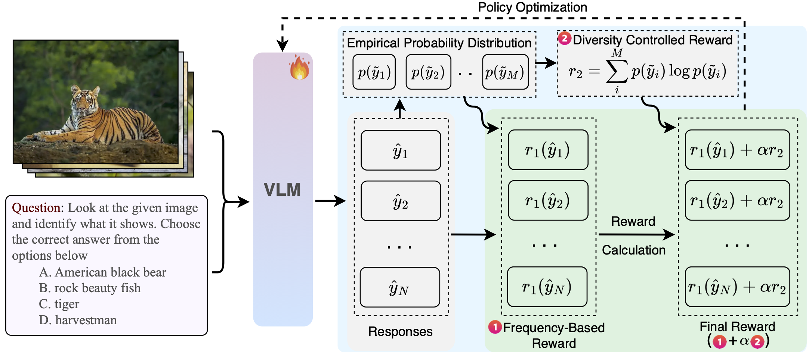

# TTRV: Test-Time Reinforcement Learning for Vision–Language Models

<p align="center">
  
</p>

## 📌 Introduction

Existing methods for extracting reward signals in Reinforcement Learning typically rely on labeled data and dedicated training splits — a setup that contrasts with how humans learn directly from their environment.  

In this work, we propose **TTRV** to enhance vision–language understanding by **adapting the model on-the-fly at inference time**, without the need for any labeled data.  

Concretely, we extend the **Group Relative Policy Optimization (GRPO)** framework by designing rewards based on the **frequency of the base model's output** while inferring on each test sample multiple times. Additionally, we **control the diversity** of the model's output by simultaneously rewarding it for achieving **low entropy** in the output empirical distribution.

Our approach delivers **consistent gains** across both **object recognition** and **visual question answering (VQA)**, with improvements of up to **52.4%** and **29.8%**, respectively, and average boosts of **24.6%** and **10.0%** across 16 datasets.  

Remarkably, on image recognition, **TTRV applied to `Intern-VL-8B` surpasses GPT-4o** by an average of **2.3%** over 8 benchmarks, while remaining highly competitive on VQA — demonstrating that **test-time reinforcement learning can match or exceed the strongest proprietary models**.  

Even in **extremely data-constrained scenarios**, where adaptation is performed on a **single randomly chosen unlabeled test example**, TTRV still yields **non-trivial improvements of up to 5.5%** in recognition tasks.

---

## ✨ Features

- ✅ **Label-free** reinforcement learning at inference time   
- 🧮 Uses **GRPO with frequency-based rewards**  
- 📊 Controls output **entropy for better diversity**  
- 📈 Demonstrates **state-of-the-art performance** on multiple benchmarks

---

## 🛠️ Environment Setup

Make sure you have **CUDA 12.4** installed for proper GPU support.

```bash
# Create and activate conda environment
conda create -y -n ttrv python=3.10
conda activate ttrv

# Clone repository
git clone https://github.com/Akshit21112002/TTRV.git
cd TTRL_VL/verl

# Install PyTorch (CUDA 12.4)
pip install torch==2.5.1 torchvision==0.20.1 torchaudio==2.5.1 --index-url https://download.pytorch.org/whl/cu124

# Install flash-attention
pip install -U flash-attn

# Other required packages
pip install python-dotenv
pip install transformers==4.52.4 
pip install vllm==0.8.3
pip install qwen_vl_utils
python -m pip install cffi
pip install latex2sympy2 word2number timm librosa soundfile

# Install TTRV framework
pip install -e .

# Install any remaining dependencies
pip install -r requirements.txt

```

# 📂 Datasets
We provide the training data used for our experiments in: **TTRV/verl/data**
To prepare your own dataset, simply replicate the same data formatting method described in the repository.


# 🚀 RUN TTRL
Once your environment is set up, you can run TTRV with the default script:
```python
# default script
bash examples/ttrv/run.sh

```

# 📜 Logs
We provide experiment logs in: **TTRV/verl/logs**
These logs include detailed outputs and evaluation metrics across multiple runs and datasets.
